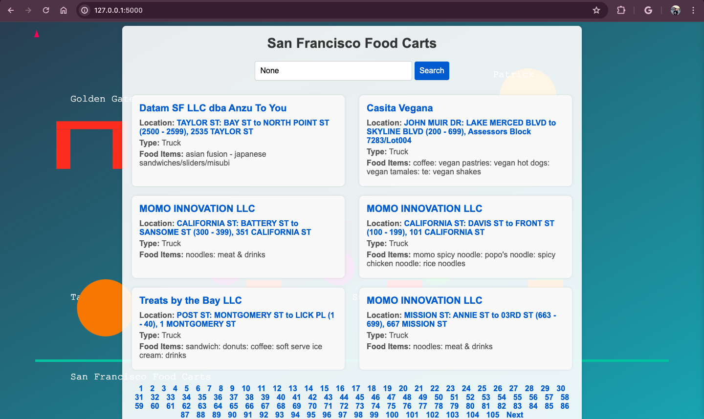
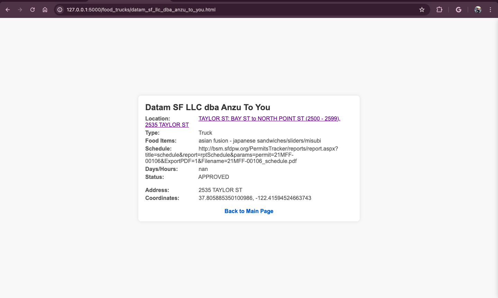
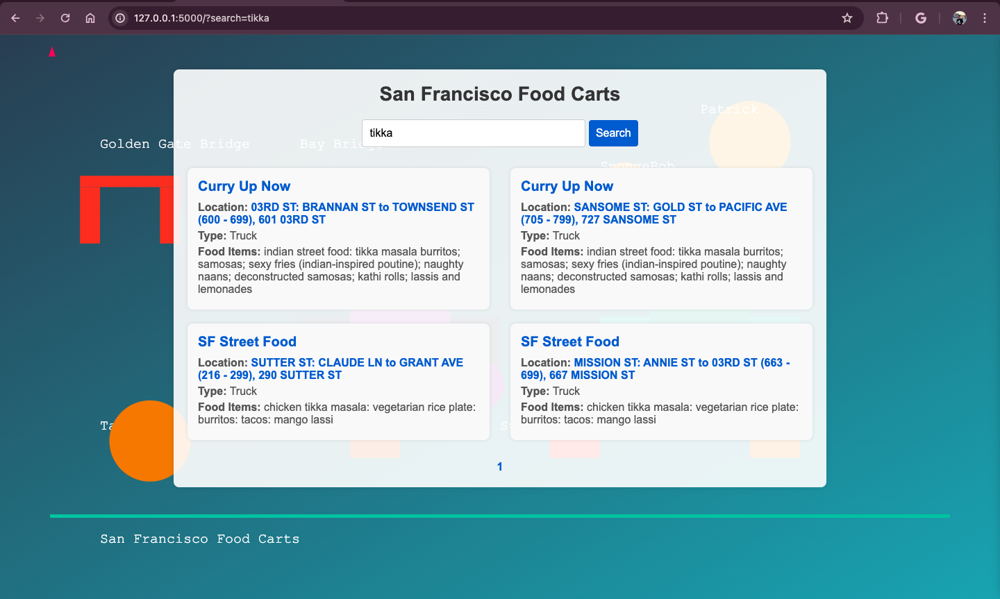
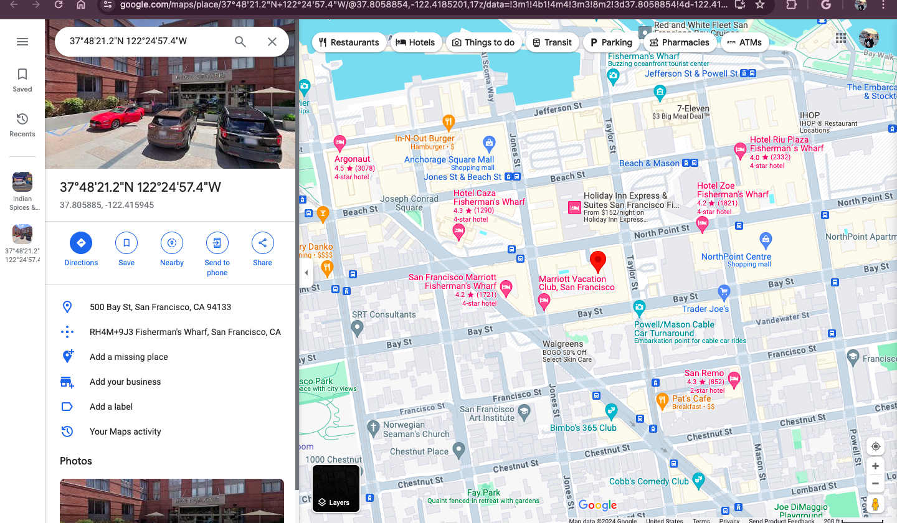

## Project Description: Food Truck Generator
The Food Truck Generator is a web application designed to help users find food trucks in San Francisco. The application allows users to search for food trucks based on the food items they offer, view detailed information about each food truck, and navigate through the results using pagination.
<p align="center">
  
  
  
  
</p>
Project Structure
data/: Contains the CSV file with data about food trucks.

food_trucks.csv
static/: Contains static assets like images.

food_carts_bg.svg
templates/: Contains HTML templates for rendering the web pages.

base.html
index.html
app.py: The main application file containing the Flask app logic.

requirements.txt: Lists the Python dependencies required for the project.

README.md: The README file providing an overview of the project and instructions on how to set it up and run it.


## Setup

1 **Clone the repository**:
   ```bash
   git clone https://github.com/utkrishtsharma/SF_foodtruck_generator.git
   cd SF_foodtruck_generator
2 Create a virtual environment and activate it (optional but recommended):

python3 -m venv venv
source venv/bin/activate  # On Windows, use `venv\Scripts\activate`

3 Install the required dependencies:

pip install -r requirements.txt

4 Run the Flask application:
python app.py

5 Open your web browser and navigate to:

http://127.0.0.1:5000
     
